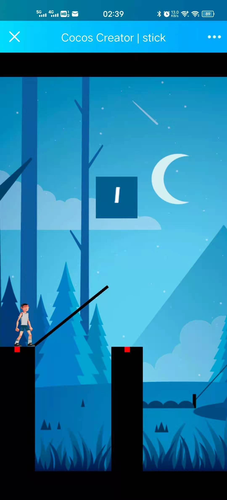

## 几个移动端的小游戏(半成品)

以下是几个基于Cocos Creator 1.x的远古程序,记得是facebook小程序刚出来的时候写的半程品(写到一半由于facebook泄露用户信息事件卡着一直不给审核直接歇逼)

**请一定用移动端打开**,网页手机模式调试似乎也不太行

## 1. [弹球](http://bagakhj.com:9090/cocos/ball)

用cocos物理引擎写的弹球小游戏,通过刚体碰撞和重力实现碰撞加速减速和着陆

## 2.[搭梯子](http://bagakhj.com:9090/cocos/stick)

## 3.[停车养成](http://bagakhj.com:9090/cocos/car)

娱乐之作整着瞎玩!!